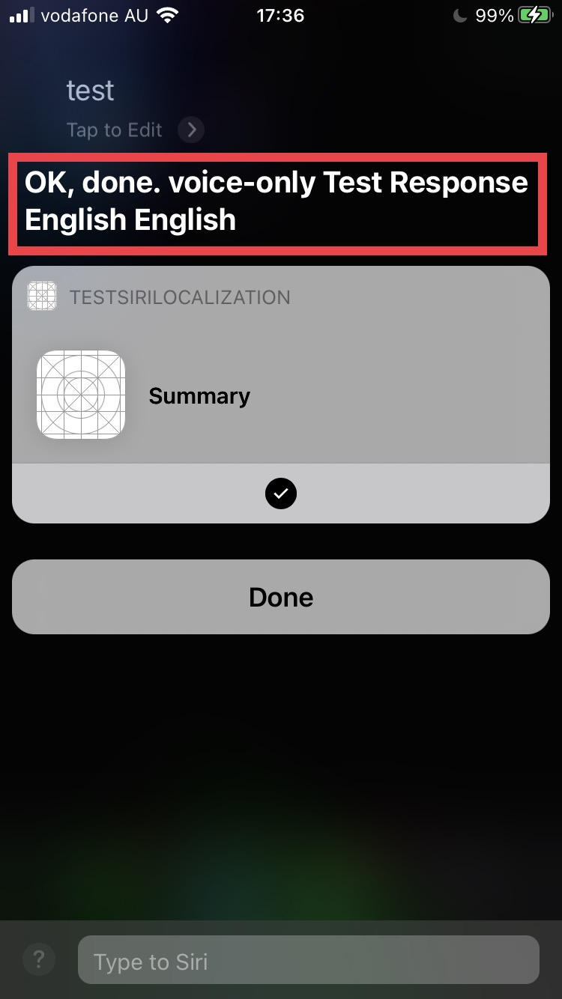
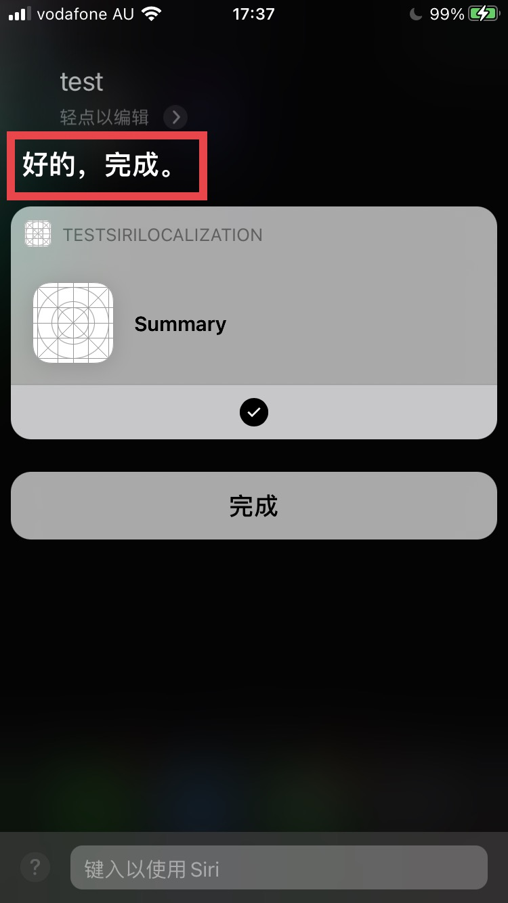
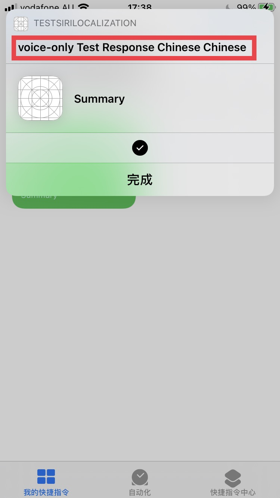

# Title

Unable to localize Siri intent response

# Description

In my project, I want my custom intent response be localized to user's Siri language.  The custom intent response has a `String` type property, and in the intent handler, a `NSLocalizedString` is passed to that property:

```objc
NSString *text = NSLocalizedString(@"response", nil);
__auto_type response = [IntentIntentResponse successIntentResponseWithText:text];
completion(response);
```

When Siri language is set to English, the intent reponse is corretly localized on screen and read out by Siri:


However, when Siri language is set to Chinese or Japanese, the localized part is missing from Siri response, leaving only "OK, done.":


And if this intent is invoked from the Shortcuts app, the localized part is corretly displayed in the pop over window, so I guess the localized string is successfully passed to the system.



So the question is, how do I make the response string localized in Siri when Siri language is set to a language other than English?

# Configuration

Xcode 12.3
iPhone SE2 (iOS 14.3)

# Steps to Reproduce

1. Download the demo project from https://github.com/eternityz/SiriLocalizationIssue
2. Open the demo project in Xcode
3. Build and run on an iOS 14 device.
4. Launch the app, add the intent to Siri with a custom phrase.
5. Make sure your Siri language is English.  Invoke Siri with the custom phrase just set.
6. Set Siri language to Chinese.
7. Invoke Siri with the same custom phrase.

# Demo Video

